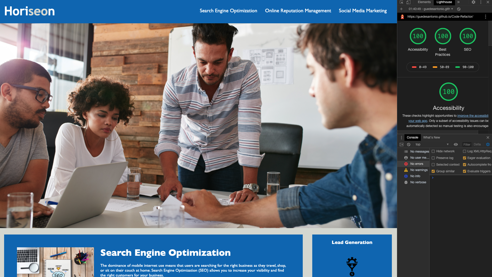

# Code Refactor

  

  ## Description
  The idea of this project was simple, take existing code and refactor it to either meet a certain set of standards or implement a new technology. Web accessibility is an increasingly important consideration for businesses, ensuring that people with disabilities or socio-economic restrictions have access to their website, and helping them avoid litigation. 

   
   [Deployed Link](https://guedesantonio.github.io/Code-Refactor/)

  ## Table of contents
  
  * [Installation](#installation)
  * [Usage](#usage)
  * [License](#license)
  * [Contributing](#contributing)
  * [Tests](#tests)
  * [Questions](#questions)

  ## Installation

  Install Lighthouse using this [here](https://developers.google.com/web/tools/lighthouse).

  ## Usage
   First the user needs open the page, Open the Dev Tools and run LightHouse.
   This way you can see the Acessibility and SEO rating of the page.

  ## License
  This application uses MIT License

  ## Contributing
  This project was written by myself for my Web Development Coding Bootcamp at the University of Sydney.

  ## Tests
  No Tests required.

  ## Questions
  If you have any questions about the repo, open an issue or contact me directly at gguedesantonio@gmail.com. 
  You can find more about my work at [Github profile](https://github.com/guedesantonio). 